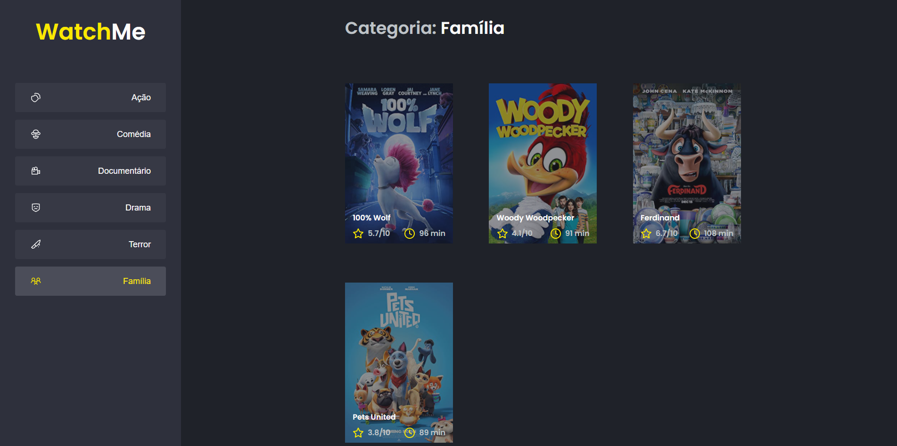

# WatchMe

## Sobre o Projeto:
WatchMe é um projeto de listagem de filmes.
A interface possuí um menu navegável com as opções de categorias.
Selecionando a categoria, os filmes respectivos a ela aparecem no dashboard.
Esse projeto foi desenvolvido durante o Ignite 2021 na trilha de ReactJS para praticar a funcionalidade de componentização.

## Como executar
Clone o projeto e acesse a pasta do mesmo.

- $ git clone https://github.com/brunafinSD/ignite-chapterI-desafio-02.git
- $ cd ignite-chapterI-desafio-02

Para iniciá-lo, siga os passos abaixo:

## Instalar as dependências
$ yarn

## Iniciar o projeto
- $ yarn server (roda a api em um terminal separado)
- $ yarn dev
- A aplicação estará disponível no seu browser pelo endereço http://localhost:8080

## Imagem

